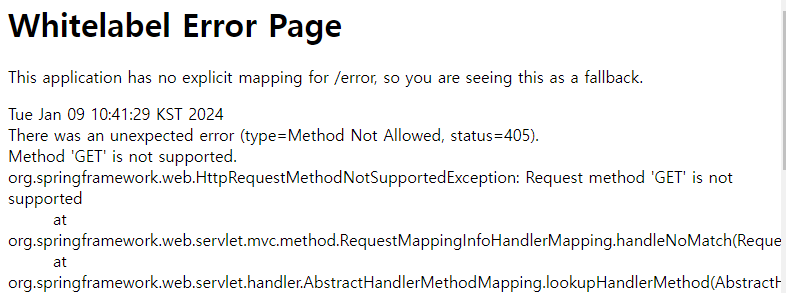

# Medium Mission Repeat (https://www.scode.gg/p/13284)

## 1. myList 구현

## 2. write 구현
- @NotBlank 어노테이션 사용으로 빈칸 허용 x
- 글 작성완료 되었다면 redirect 로 처리
- @PreAuthorize() 어노테이션으로 권한 제한
- 그에 맞게 write.html 생성하고 폼 맞추기
- PostController 에서 사용한 writeForm에 isPublished를 이용해 공개 여부 true, false 사용
- 이번 판 에러.... 자꾸 

2024-01-08T14:38:17.635+09:00 ERROR 26612 --- [omcat-handler-9] o.a.c.c.C.[.[.[/].[dispatcherServlet]    : Servlet.service() for servlet [dispatcherServlet] in context with path [] threw exception [Request processing failed: org.thymeleaf.exceptions.TemplateInputException: An error happened during template parsing (template: "class path resource [templates/domain/post/post/myList.html]")] with root cause ...

란 에러가 떠서 html 내에 타임리프 부분이 잘못된 줄 알았지만, 컨트롤러 write 메서드 보면
return을 myList로 하고 있었음. myList가 아니라 write이다. 연계성 없는 메서드가 다른 html로 return 하면 해당 html에선 null 값이 들어올 수 밖에 없다.

## 3. QueryDSL 도입, 글 목록, 내글 목록

- querydsl 이용해 비공개 글은 전체 글 목록에서 숨겨질 수 있다.

## 4. 수정 구현

- Controller에 modify 메서드 생성
  - 예외처리 클래스를 따로 만들어 놓는 것이 나중에 편리함
  - 수정 처리할 땐 PutMapping으로 설정
- PostService에서 Modify 메서드 @Transactional로 처리
  - 매서드 내에서 발생하는 모든 DB 조작은 전부 성공하거나 전부 실패
  - 트랜잭션으로 묶이면 데이터의 일관성을 유지하고 에러가 발생할 경우 롤백하여 이전 상태로 돌아가게 함
- 나머지 처리는 html에서 타임리프 이용

## 5. 삭제 구현

- 글 삭제는 html에서 form으로 처리
- 컨트롤러, 서비스, html로 삭제 기능 구현했지만 다음과 같은 에러가 발생


삭제 처리가 제대로 안된 모습인데, 아마 csrf 토큰 관련한 문제라 강사님께서 그러셨다. global.js와 layout.html에 각각 다음과 같은 코드 쓰면 처리 가능

```javascript global.js
$(function () {
    $('select[value]').each(function (index, el) {
        const value = $(el).attr('value');
        if (value) $(el).val(value);
    });

    $('a[method="DELETE"], a[method="POST"], a[method="PUT"]').click(function (e) {
        if ($(this).attr('onclick-after')) {
            let onclickAfter = null;

            eval("onclickAfter = function() { " + $(this).attr('onclick-after') + "}");

            if (!onclickAfter()) return false;
        }

        const action = $(this).attr('href');
        const csfTokenValue = $("meta[name='_csrf']").attr("content");

        const formHtml = `
        <form action="${action}" method="POST">
            <input type="hidden" name="_csrf" value="${csfTokenValue}">
            <input type="hidden" name="_method" value="${$(this).attr('method')}">
        </form>
        `;

        const $form = $(formHtml);
        $('body').append($form);
        $form.submit();

        return false;
    });

    $('a[method="POST"][onclick], a[method="DELETE"][onclick], a[method="PUT"][onclick]').each(function (index, el) {
        const onclick = $(el).attr('onclick');

        $(el).removeAttr('onclick');

        $(el).attr('onclick-after', onclick);
    });
});
```

```html layout.html
    <!--이전내용-->
    <meta name="_csrf" th:content="${_csrf.token}"/>
    <meta name="_csrf_header" th:content="${_csrf.headerName}"/>
    <!--이후내용-->
```